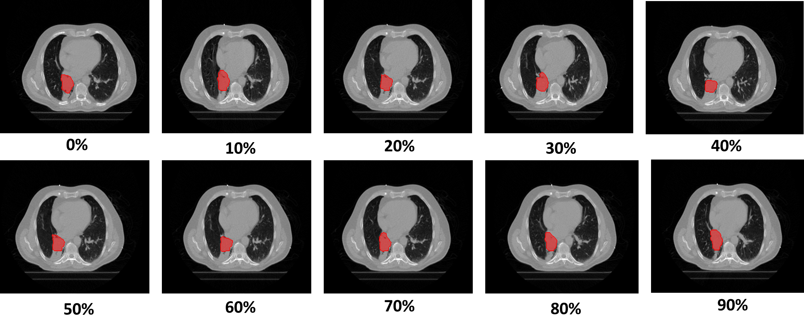
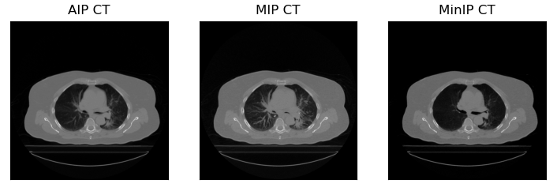
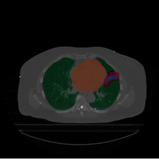
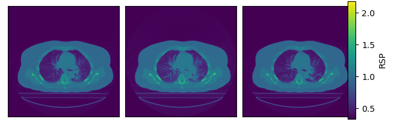

## Pre-processing Algorithm

Welcome to the Pre-processing Algorithm documentation, a fundamental step in our comprehensive proton therapy beam selection. This algorithm plays a crucial role in preparing input data for the Angle Selection Algorithm. Our primary goal is to convert complex 4D CT scans into valuable representations suitable for radiation therapy. In this documentation, we'll guide you through each stage of the process, from generating CT scan representations like AIP, MIP, and MinIP to delineating radiation therapy volumes, including GTV, CTV, and iCTV. We'll also discuss the conversion from Hounsfield Units (HU) to Relative Stopping Power (RSP), a critical transformation for proton therapy. By the end of this guide, you'll have a comprehensive understanding of how our pre-processing algorithm sets the stage for precise proton therapy planning. Whether you're a researcher, medical professional, or enthusiast, this documentation provides insights into the essential steps that pave the way for effective personalised proton beam therapy. Let's dive into the details of our pre-processing algorithm to see how it prepares the input data for the subsequent angle selection process.

### Input Data:

This pre-processing algorithm readies input data for the Angle Selection Algorithm. It utilises 4-Dimensional Computed Tomography scans (4DCT). In 4DCT, multiple time-stamped images form a dynamic sequence akin to a video, providing insights into physiological processes and internal movements. These scans are particularly useful for analysing mobile tumours, especially in the thoracic region, as they reveal patient-specific intrafractional motion. A 4DCT scan consists of ten 3D CT scans, each representing a specific respiratory phase within the breathing cycle. DICOM RT structure files, one for each phase, contain delineations of the tumou and organs at risk (OAR), crucial for accurate proton therapy planning.

  

The input data for our algorithm comprises the 4DCT scans and delineations, which have been converted from the Digital Image Communication in Medicine (DICOM) format into arrays. For details on converting DICOM to arrays, you can refer to [Kerem et al.'s](https://github.com/KeremTurgutlu/dicom-contour) repository, dicom-contour, which provides a comprehensive resource on this process. In our algorithm, each phase of the 4DCT scans is transformed into a 3D array where the voxel coordinates indicate the geometric location, and the voxel value represents the Hounsfield Units (HU). The delineations are represented in an array of the same dimensions as the image, with a voxel value of 1 indicating the masked contour, effectively outlining the regions of interest.

### Generating CT Scan Representations from 4D CT 
 In radiation therapy, both for diagnostic, treatment planning and volume delineations for cancers in the thoracic regions, a 3D representation of a 4D CT scan can be constructed. Among various multiplanar reconstructed scans, the three most prominently used are the Average Intensity Projection (AIP), the Maximum Intensity Projection (MIP), and the Minimum Intensity Projection (MinIP). In the 4DCT preprocessing all of the above CT scan representations are generated.
 
 * **AIP:** Displays the average attenuation of all voxels of the index.
 * **MIP:** Displays the voxel with highest attenuation of the index.
 * **MinIP:** Displays the voxel with minimum attenuation of the index. 

  

### Radiation Therapy Volumes
The first step of treatment planning is the delineation of the target volumes and organs at risk. In the utilised dataset, the Gross Tumour Volume (GTV) and organ volumes were delineated by an experienced oncologist. To account for for subclinical microscopic malignant regions that are not visible in the GTV, an isotropic margin is imposed to generate the Clinical Target Volume (CTV). Additionally, to account for internal physiological movements, size and shape variations of the tumour the Internal Target Volume is constructed. For lung cancer cases where a 4D CT scan is acquired, we can construct the iGTV and iCTV (5 mm isotropic margin was employed in our study to transform GTV to CTV) through a geometric summation of GTV and CTV volumes from all breathing phase. Furthermore, to incorporate the extend of the motion of OARs a similar geometric summation was performed. In the scan bellow we can identify the iGTV in blue, iCTV in red, the lungs in green, the heart in orange and the spinal cord in white for patient B.

  

### Hounsfield Units (HU) to Relative Stopping power (RSP)
A CT voxel value is a representation of the voxel’s photon attenuation relative to water. However, for the purposes of proton beam therapy, since the interaction mechanisms of the two radiation types vary, a conversion from HU to proton Relative Stopping Power (RSP) needs to be performed to estimate the proton beam range. To achieve this, a stoichiometric calibration of the CT scanner should be performed, as described by Schneider et al, to generate a conversion Hounsfield Unit Look up Table (HULT). The HULT utilised in the pre-processing code was for the specific CT scan utilised during image acquisition of our dataset and should be re-calculated for any other scan utilised. The converted CT scans for patient B are visualised below, with Phase 0 on the left, the AIP in the middle and the MIP on the right. Voxel values now represent the proton stopping power within each voxel relative to the stopping power in water. 

  

