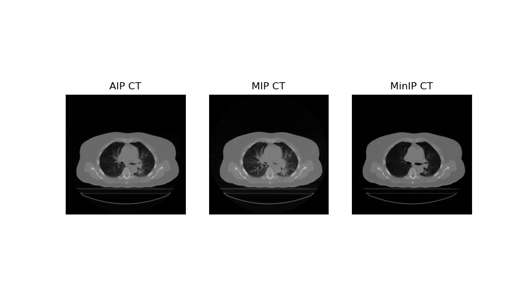

**Generating CT Scan Representations from 4D CT** 
  In radiation therapy, both for diagnostic, treatment planning and volume delineations for cancers in the thoracic regions, a 3D representation of a 4D CT scan can be constructed. Among various multiplanar reconstructed scans, the three most prominently used are the Average Intensity Projection (AIP), the Maximum Intensity Projection (MIP), and the Minimum Intensity Projection (MinIP). In the 4DCT preprocessing all of the above CT scan representations are generated.
 
 * **AIP:** Displays the average attenuation of all voxels of the index.
 * **MIP:** Displays the voxel with highest attenuation of the index.
 * **MinIP:** Displays the voxel with minimum attenuation of the index. 

**Radiation Therapy Volumes**
  The first step of treatment planning is the delineation of the target volumes and organs at risk on the planning CT scan. In the utilised dataset, the Gross Tumour Volume (GTV) and organ volumes were delineated by an experienced oncologist. To account for for subclinical microscopic malignant regions that are not visible in the GTV, an isotropic margin is imposed to generate the Clinical Target Volume (CTV). Additionally, to account for internal physiological movements, size and shape variations of the tumour the Internal Target Volume is constructed. For lung cancer cases where a 4D CT scan is acquired, we can construct the iGTV and iCTV through a geometric summation of all GTV and CTV volumes from each breathing phase. Furthermore, to incorporate the extend of the motion of OARs a similar geometric summation was performed. In the scan bellow we can identify the iGTV in blue, iCTV in red, the lungs in green, the heart in orange and the spinal cord in white for patient 104
 
