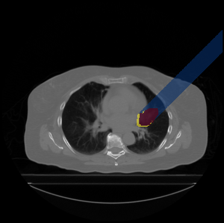
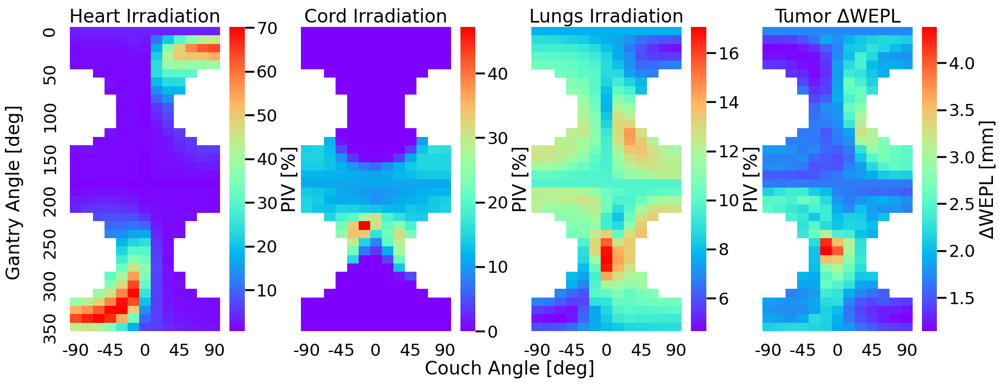
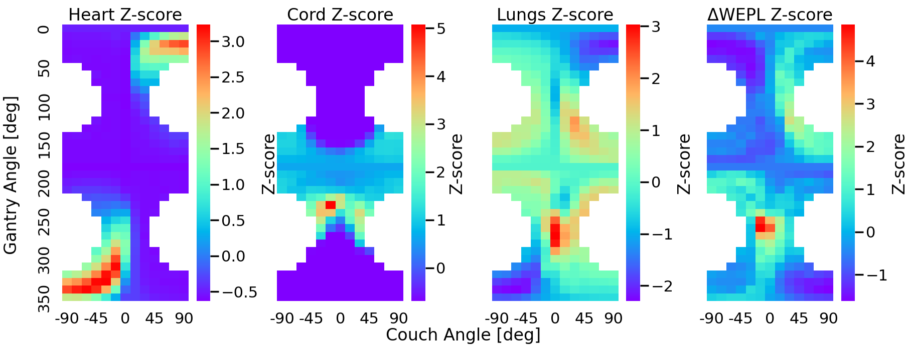
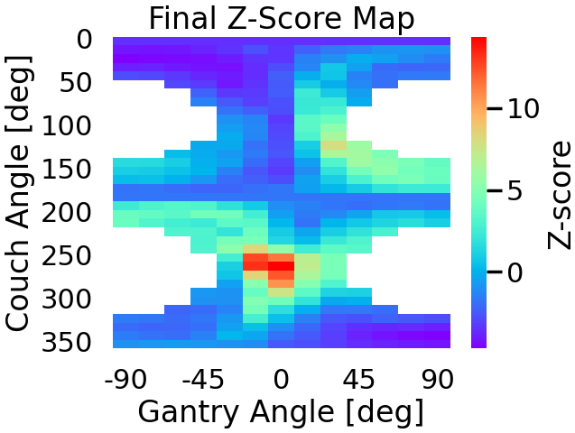
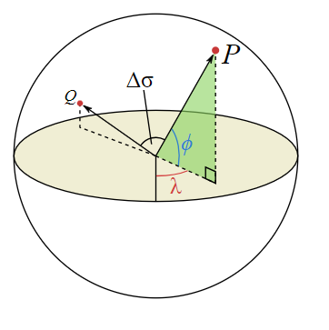

## Angle Selection Algorithm

Welcome to the Angle Selection Algorithm documentation. Our algorithm is designed to assess the impact of incident beam geometry on treatment plan quality in proton therapy of lung cancer. In this comprehensive guide, you'll find detailed information on how our algorithm identifies irradiated voxels for various beam geometries by simulating proton beam paths. We'll delve into the essential components, including transformation matrices for gantry and couch angles, distal edge identification, and the generation of beam rays. Additionally, we'll explore the analysis of Water Equivalent Path Length (WEPL) and Percentage Irradiated Volume (PIV) of Organs-At-Risk (OARs) maps to optimise proton beam geometries. With the integration of Z-score statistics, we normalise and combine these maps to create a unified metric. Whether you're a researcher, medical professional, or simply curious about proton therapy, this documentation will provide insights into our angle selection algorithm's inner workings and applications. 
### Beam Simulation 
To assess the impact of incident beam geometry on plan quality, we developed an angle selection algorithm. This algorithm identifies the irradiated voxels for any given beam geometry by simulating proton beam paths. It relies on couch and gantry angles to determine the relative beam direction, achieved through rotation transformation matrices for an input CT scan oriented along the SI, AP, and RL direction.

**Transformation Matrices:**
  For gantry angle (GA) and couch angle (CA), the transformation matrices are defined as follows:

$$ GA = \begin{pmatrix}
    1 & 0 & 0 \\
    0 & \cos(GA) & \sin(GA) \\
    0 & -\sin(GA) & \cos(GA)
\end{pmatrix} \quad
CA = \begin{pmatrix}
    \cos(CA) & 0 & -\sin(CA) \\
    0 & 1 & 0 \\
    \sin(GA) & 0 & \cos(GA)
\end{pmatrix} $$

  Instead of directly transforming the scans, we divide the beam path into discrete steps, initiating from the tumour’s distal edge points and inversely simulating the proton beam paths. We utilise a directional vector [0,-1,0] to represent each step's direction, ensuring that for gantry and couch angles of 0 degrees, the beam travels normally towards the patient from the anterior direction. Utilising this methodology, the beam path step vector (magnitude 1 voxel) is calculated for any arbitrary gantry-couch angle combination.

**Distal Edge Identification:**
 To identify the tumour’s distal edge for various angle combinations, we employ a binary search approach. The algorithm uses the estimated step distance, derived from beam geometry, and the tumour’s spatial coordinates to search along the direction of the beam path. The binary search continues until non-tumour tissue is encountered or a predetermined threshold is reached at the tumour boundary. Successful execution of the binary search results in an array containing the distal edge coordinates of the tumour.

**Generating Beam Rays**

  Subsequently, we simulate beam rays inversely, using the estimated distal edge points and the beam step vector. Initiating from the identified distal edge points, the algorithm generates lines representing beam trajectories by incrementing the coordinates in the opposite direction of the beam ray. This iterative process continues until the proton ray reaches the image boundaries, encompassing all distal edge points. To handle steps with decimal places, only the coordinate corresponding to a unique voxel traversed by the beam is rounded up, while the rolling sum of coordinates retains decimal precision. The output consists of a list of lists, where each inner list contains the irradiated voxels along the proton ray's path, terminating at a distal edge point. While the outer list contains all proton ray paths that in unity encompass the proton beam for that geometry. In the adjacent image, we visualise the simulate beam for gantry angle 45 and couch angle 0 degrees in blue, the tumour in red and the distal edge in yellow. The distal edge was expanded by 5mm for visualisation purposes.

### Risk Maps: ΔWEPL and PIV
Optimal proton beam geometry should consider both sufficient tumour coverage and minimal organs at risk dose. We evaluated tumor coverage using Water Equivalent Path Length (WEPL) analysis and assessed organs at risk using Percentage Irradiated Volume (PIV). Calculations were performed for approximately 350 beam orientations, with the 2D risk maps below depicting  the results for patient B.

**Tumour Coverage:**
  WEPL represents the path that the proton beam would traverses through water, calculated by summing the relative proton stopping power ratio (SPR) multiplied by the cohort length (lenght traveled within the voxel). Thus, the RSP converted CT scans from our pre-processing algorithm were used as the input. In the context of proton beam therapy for lung cancer, treatment planning is performed on a static representation of the target volume. A key objective is to minimise the variations in WEPL (ΔWEPL) along the planned and evaluated beam paths, aiming to reduce uncertainties in proton range.
We determined the reference WEPL from planning CT scans (AIP CT from pre-processing) for each proton ray with specific gantry-couch angles. We also computed the WEPLs of each ray for all breathing phases from the converted RSP 4DCT scans. ΔWEPL for each ray was calculated by subtracting the absolute value of reference WEPL from the evaluated WEPL. The average of all proton rays yielded a single-phase proton beam ΔWEPL, while averaging over all phases provided the overall ΔWEPL value representative of the entire beam. 

**Organs At Risk Dose:**
  The impact of incident beam geometry on the accumulated dose for organs at risk was evaluated through the Percentage Irradiated Volume (PIV). PIV measures the overlap between the incident beam and the organ, normalised by the total organ volume. Organs at risk considered in this algorithm are the heart, lungs and spinal cord, but the methodology could be expanded to incorporate organs such as the trachea and the esophagus.

  

### Z-Score Normalisation.
We integrated information of the ΔWEPL and PIV maps using the Z-score statistic. This statistical method standardized the values of each map, allowing us to combine them into a single metric. Z-score conversion was applied on every pixel in the ΔWEPL and PIV maps shown above as described by the equation bellow. This transformation turned pixel values into relative variables, indicating their deviation from the population average in terms of standard deviation. Positive Z-scores represented values above the mean, while negative Z-scores indicated values below the mean.

$$
Z = \frac{x_i - \mu}{\sigma}
$$

Below, you can see the Z-score-normalised ΔWEPL and PIV maps for patient 104. Upon comparison with the previously mentioned maps, we observed consistent behavioural patterns, with only variations in pixel values.

  

   To create a unified metric, we followed a methodology similar to a treatment planning optimisation process, where weighting factors are applied to plan parameters. In this case, we multiplied each map with distinct weighting factors and then summed them to generate the Final Risk (FR) map. These weighting factors were determined based on various considerations, including patient anatomy, analysis of variable effectiveness maps, and the patient's prior medical history. This approach allowed for adjustments between plan objectives during the angle selection process, enabling a higher flexibility during treatment planning. The mathematical formulation of the FR map is defined as,

$$
x_i^{\text{FR}} = \sum_{Z} W_z x_i^Z = W_T x_i^T + W_H x_i^H + W_L x_i^L + W_S x_i^S
$$

For patient B, we applied specific weighting factors as follows: a tumour weighting factor of 2, 1.5 for the heart, 1.8 for the lungs, and 0.5 for the spinal cord. The resulting Final Risk map is shown below.

  

### Angle Selection 

  Using the Final Risk map for each patient, we could extracted and utilised any number (N) angle combinations for treatment planning. These optimal angles were identified by selecting the N-angle combination with the lowest risk score. To prevent cross-beam irradiation, we enforced a minimum X-degree angle separation between all beams. We assessed beam separation based on the Central Angle theorem, which describes the angular separation of two points located on the surface of a sphere. In our case, these two points represented the starting points of the incident beams determined by the couch and gantry angle combination. The central angle theorem was thus defined as, 

$$
\text{CA} = \arccos(\sin(\text{GA}_1) \sin(\text{GA}_2) + \cos(\text{GA}_1) \cos(\text{GA}_2) \cos(|\text{CA}_1 - \text{CA}_2|))
$$

It's worth noting that the number of beams N and beam separation X can be adjusted to accomodate the treatmetns need of each patient.

