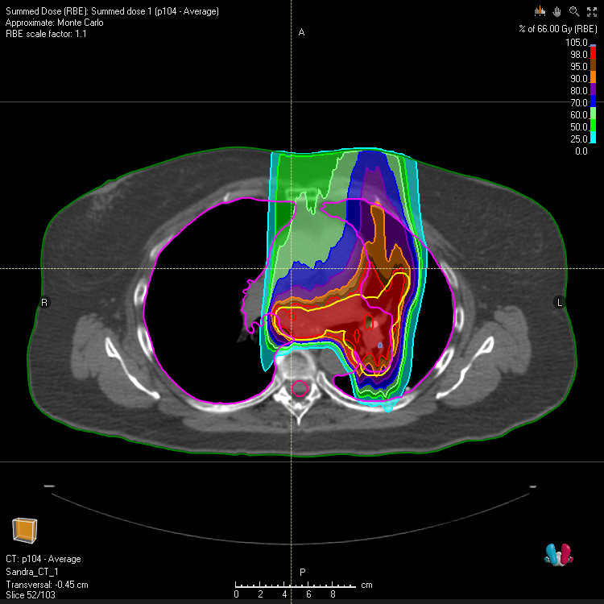
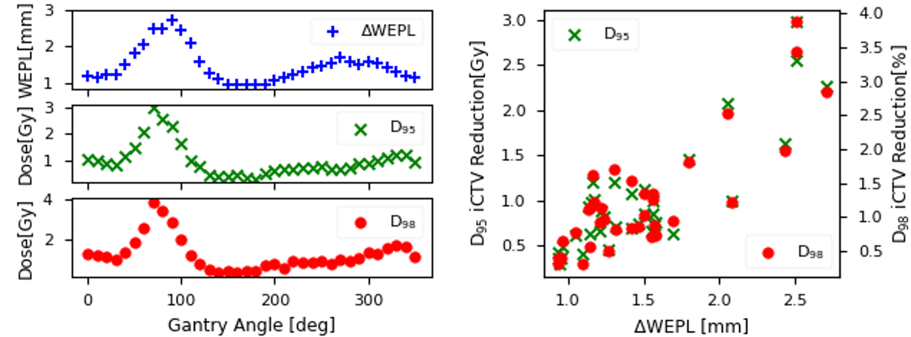
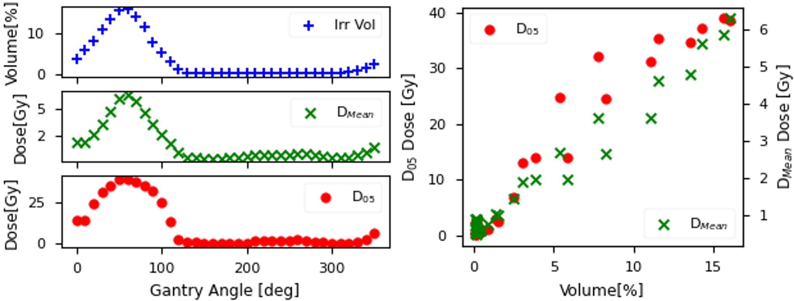
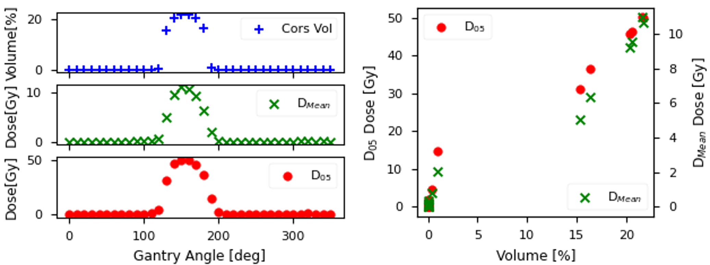
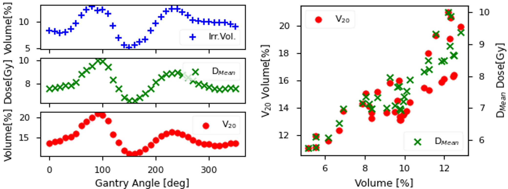
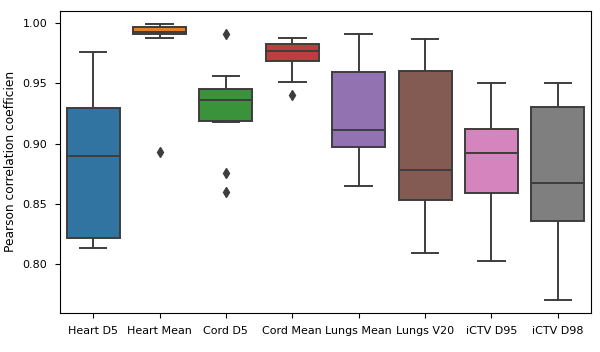

## Angle-Selection Validation

### Dataset 
To evaluate the effectiveness of our beam angle optimization algorithm, we conducted an analysis involving 11 patients diagnosed with non-small cell lung cancer (NSCLC). This patient cohort was deliberately selected to encompass diverse factors, including variations in tumor sizes, motion amplitudes, and lung tumor locations, mirroring the clinical landscape. Patient data for this analysis was sourced from The Cancer Imaging Archive (TCIA) 4D Lung Dataset, which provides a comprehensive collection of 4DCT datasets from 20 lung cancer patients, readily accessible to the research community.
  An experienced radiation oncologist delineated target volumes and organs at risk. For each patient, the gross tumor volume (GTV) was initially delineated across all ten breathing phases. Due to the extensive nature of the dataset, delineations of organs at risk were performed on a subset of images. Consequently, we utilised data from 11 patients in this study, ensuring the delineation of all relevant organs at risk. The patient numbers align with those in the TCIA archive to maintain reproducibility.

### Validation Plans

To assess the efficacy of our angle selection algorithm for proton beam therapy in mitigating the effects of intra-fractional motion, we executed comprehensive validation plans. This involved the generation of 36 single-beam uniform treatment plans for each patient. These treatment plans were created using RayStation 12A (RaySearch, Stockholm) and covered beams at 10-degree gantry angle intervals from 0 to 360 degrees, all with a fixed couch angle of 0 degrees. Each plan was generated and optimised based on the AIP CT scan, with planning conducted on the iCTV and normalization such that the median iCTV dose equalled the prescribed dose. We employed standard fractionation plans with 33 fractions of 2 Gy for all patients.
  To evaluate variations in target dose coverage and organ dose accumulation arising from respiratory-induced motion, the single-beam plans were deformably transferred to each of the ten 4DCT phases and subsequently averaged, assuming an equal contribution from each breathing phase. We recorded reductions in tumor dose by inspecting the iCTV D95 and D98 relative to the planned values. Additionally, we documented OAR dose statistics.
  The impact of the ΔWEPL metric on tumor dose reduction and OAR irradiation in relation to OAR accumulated dose was analysed and quantified using the linear Pearson's correlation coefficient (PCC). This extensive validation process ensures the reliability and effectiveness of our angle selection algorithm for proton therapy in lung cancer cases.

### Results 
The angle-dependent plots below demonstrate the impact of incident beam angle on assessed dose parameters, offering insights into the anticipated beam simulation outcomes. Below we depict an example from patient 104, highlighting the influence of incident beam geometry on tumor coverage through ΔD95 and ΔD98. Particularly noteworthy is the strong correlation observed between average ΔWEPL values and tumor dose degradation. This correlation effectively allows for the identification of angles characterized by significant or minor fluctuations caused by respiratory motion.

  
 
 
 In the following graphs, we visualize the impact of incident proton beams on OAR doses for patient 104, represented by the D05 and DMean for the heart and spinal cord, as well as DMean and V20 for the lungs. Similar to tumour behaviour, a robust correlation between the Percentage Volume Irradiation (PIV) of the examined OAR and the resulting organ dose statistics is evident. This correlation allows for the identification of incident beam orientations that effectively minimise accumulated organ doses.

  
  
  

Similar trends were observed throughout the entire patient cohort, demonstrating consistent behaviour in terms of both tumour dose degradation and accumulated organ doses. Subsequently, the Pearson Correlation Coefficient (PCC) statistical test was conducted to analyse the findings of the angle selection algorithm, with the results illustrated in the box plot below. 
 The mean ΔWEPL exhibited a strong positive correlation with iCTV D95 and D98 reduction, with an average PCC of 0.90 and 0.87 across the patient population. Furthermore, the PIV of OARs displayed a robust positive correlation with accumulated organ doses. The population average PCC values were reported at 0.88 for heart D5, 0.98 for heart Mean, 0.93 for spinal cord D5, 0.97 for spinal cord Mean, 0.90 for lungs Mean, and 0.89 for lungs V20. These results emphasise the significant impact of beam orientation on organ dose and the effectiveness of the angle selection algorithm in optimising proton therapy beam orientations.

  
 
 
